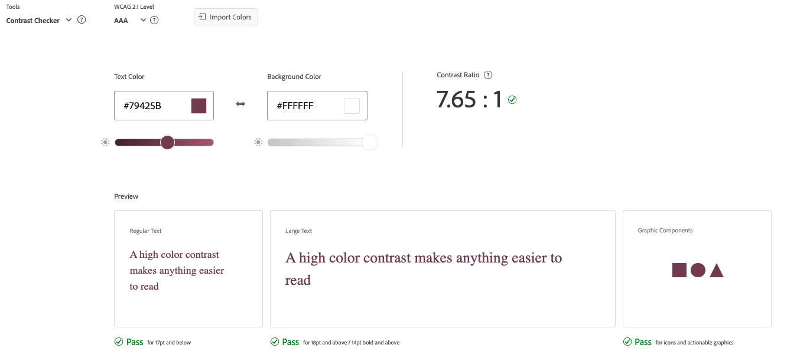

# Film Buzz 

## Introduction

Film Buzz is a movie blog platform built with Django, featuring full CRUD functionality that allows for creating, reading, updating, and deleting content. Users can explore insightful blogs, discover curated movie recommendations, and read thought-provoking reviews.

The aim of this project was to create a site that provides an engaging space for movie lovers to stay informed, share their passion for cinema, and connect with a like-minded community while offering dynamic content management capabilities.

Developed by **Ray Carter**

View live site here: [Film Buzz website](https://film-buzz-374754df9761.herokuapp.com/)

------

## Table of Contents

## Overview

### About

Film Buzz is a dynamic movie blog platform built with Django, designed to celebrate cinema and provide a space for movie lovers to explore, discuss, and engage with the world of film. 

The goal of this project is to create an accessible and engaging platform for casual viewers, film enthusiasts, and aspiring movie bloggers alike. Built with the powerful Django framework, Film Buzz combines functionality with user-friendly design to deliver an enjoyable and seamless experience for all.

### Purpose

Many movie enthusiasts struggle to find a platform where they can read insightful reviews, explore curated movie recommendations, and stay updated on the latest in cinema. While casual viewers seek engaging content to guide their next movie choice, aspiring reviewers and bloggers often lack a centralised space to share their thoughts and connect with like-minded individuals. This gap leaves movie lovers without an accessible, community-driven hub for exploring and discussing their passion for film.

Film Buzz aims to solve this problem by providing a simple and engaging platform for movie enthusiasts to:
- Discover insightful reviews on a variety of films.
- Explore curated movie recommendations tailored to different tastes and genres.
- Read thought-provoking blogs and articles about cinema, including behind-the-scenes content and trends.
- Engage with content designed to inspire a deeper appreciation for the art of film.
- Offer a space for aspiring movie bloggers and critics to share their perspectives and grow their audience.

By offering these features, Film Buzz becomes a hub for celebrating cinema, fostering connection, and guiding viewers in their cinematic journeys.

### Target Audience

Film Buzz is designed to cater to a wide range of movie lovers, each with unique needs and interests:
- **Movie Enthusiasts**:
    - People who are passionate about watching, reviewing, and discussing movies.
- **Casual Viewers**:
    - Individuals looking for movie recommendations and reviews to decide what to watch next.
- **Reviewers and Bloggers**:
    - Professionals or hobbyists who want to share detailed critiques and engage with their audience.
- **Social Users**:
    - Users who enjoy following others, discovering popular content, and engaging in discussions.
- **Students and Professionals in the Film Industry**:
    - Aspiring filmmakers, critics, and actors seeking inspiration and community insights.

## UX

### Design Inspiration

### Colour Scheme

- YinMn Blue `#294E79` - used as the primary site colour, and secondary background colour for the footer.

- White `#FFFFFF` - used as site background colour for a clean and minimalistic design.

- Light Cyan `#D3F3FA` - used as an accent text colour on the YinMn Blue footer.

- Quinacridone Magenta `#79425B` - used as a secondary colour to add contrast and variety.

- Seal Brown `#603317` - used for the trash icon,  notification icon and warning buttons to ensure prominence and clarity.

To design a visually appealing and thematic colour palette for my website, I utilised a combination of [Color Hunt](https://colorhunt.co/) and [Coolors](https://coolors.co/). My goal was to craft a palette that resonates with movie enthusiasts, blending style and accessibility.

The centrepiece of this palette is **YInMn Blue**, chosen as the primary colour to define the brand identity of Film Buzz with its vibrant and modern appeal. Complementing this, I selected **White** as the background colour to ensure a clean, easy-to-read layout that enhances the overall user experience.

### Contrast Ratio: Primary Colours

I wanted to ensure that the chosen primary text colour (**YInMn Blue** - `#294E79`) and background colour (**White** - `#FFFFFF`) met the web accessibility standards outlined by [WCAG](https://www.wcag.com/). WCAG defines a minimum colour contrast ratio of **4.5:1** for normal text and **3:1** for large text.

I tested the contrast ratio using [Adobe’s](https://color.adobe.com/create/color-contrast-analyzer) colour contrast checker tool, which gave me a contrast ratio of **8.54:1**, and ensured that good readability for visually impaired site users. 

### Contrast Ratio: Secondary Colours

I also used [Venngage’s Accessible Color Palette Generator](https://venngage.com/tools/accessible-color-palette-generator) to create complementary colours that harmonise seamlessly with my primary colour while adhering to WCAG colour accessibility standards. To ensure optimal readability, I tested the contrast ratios of these colours using Adobe's Colour Contrast Checker tool. This process guided my design decisions and helped me pair colours effectively throughout my website.

For light cyan on a YInMn Blue background, I achieveed a contrast ratio of **7.3:1** 

For quinacridone magenta on a white background, I achieved a contrast ratio of **7.65:1**

For seal brown on a white background, I achieved a contrast ratio of **10.59:1**

### Typography

- [Raleway](https://fonts.google.com/specimen/Raleway) - Used for headings and buttons.
- [Inter](https://fonts.google.com/specimen/Inter) - Used for site text and paragraphs.

### Logo design

I used [Logo Design AI](https://logodesign.ai/) to generate the following logo design for my website. I also generated the same logo with a white background, which was used in the footer section of the website, and I removed the background using [Remove Bg](https://www.remove.bg/)

## User Stories

### Developer

- As a developer I can get an idea of the whole design system so that I can work on the UI/UX design. `Must Have`

- As a developer I can get an idea of which components to build so that I can work on the design system. `Must Have`

- As a developer I can build the pages based on the Figma designs so that I can check how the website looks in real time. `Must Have`

### Site Admin

- As an admin I can add, edit, or delete posts so that the database remains accurate. `Must Have`

- As a site admin, I can access a page exclusive to admins to view flagged user posts so that I can review posts that may need moderation or deletion. `Could Have`

- As a site admin, I can unflag a post if it does not require deletion so that I can remove it from the list of flagged posts. `Could Have`

- As an admin I can suspend user accounts who violate site guidelines so that I can prevent users from breaking the site rules. `Won’t Have`

- As an admin, I can view analytics on user activity and engagement so that I can better understand how the platform is performing. `Won’t Have`

### New Site users

- As a first time site visitor I can clearly see the website's purpose so that I can use it in the future. `Must Have`

- As a new site user I can create an account so that I can make my profile. `Must Have`

- As a site visitor/user I can easily navigate the site on any device so that I have a seamless experience whether on desktop or mobile. `Must Have`

- As a user/visitor I can see trending movies on the homepage so that I can discover what movies are popular right now. `Won’t Have`

### Registered users

- As a registered user I can login to my account so that I can access the site. `Must Have`

- As a registered user I can log out of my account so that I can delete session on my current device. `Must Have`

- As a registered user I can create posts so that I can share my thoughts about different movies. `Must Have`

- As an author I can edit my posts so that I can correct information in the future. `Must Have`

- As an author I can delete my posts so that I can remove content that I no longer want to be published. `Must Have`

- As a user I can view all the posts so that I can learn about different movies. `Must Have`

- As a commenter I can delete existing comments so that I can remove my opinions. `Must Have`

- As a user I can filter posts so that I can view posts of a specific movie genre. `Must Have`

- As a user I can search posts so that I can filter posts based on titles. `Must Have`

- As a registered user I can delete my account so that I can stop using the site when I no longer need it. `Should Have`

- As a registered user I can comment on other users' posts so that I can engage with them in a discussion. `Should Have`

- As a user I can follow other users so that I can keep up with their posts. `Should Have`

- As a registered user I can create my own watchlist so that I can track movies I am interested in watching. `Could Have`

- As a commenter I can edit my existing comments so that I can correct information. `Could Have`

- As a registered user I can update my profile information so that other users can identify me. `Could Have`

- As a registered user I can receive personalised movie recommendations based on my watchlist and reviews so that I can discover films tailored to my preferences. `Won’t Have`

- As a reviewer I can tag other users in comments so that I can engage directly with the community. `Won’t Have`

- As a registered user I can sync my watchlist with streaming platforms so that I know where to watch my saved movies. `Won’t Have`

## Wireframes

### Low-Fidelity Wireframes

### High-Fidelity Wireframes

## Features

## Database Design

## Agile Development Process

### MoSCoW Prioritisation

### GitHub Projects 

I used [GitHub Projects](https://github.com/users/raycarter23/projects/3) as an Agile tool to streamline the development process for this project.

The **Kanban Board** provided by GitHub Projects enabled me to:
- Organise tasks according to the development cycle phases: Backlog, To Do, In Progress, and Done
- Map out the workflow for user stories and their implementation
- Visualise the progression of user stories at every stage
- Track progress by moving tasks across columns as they were completed

Here is an overview of my GitHub Projects setup at the beginning of the development process:

### GitHub Issues

I used GitHub Issues to create and manage my User Stories.

My User Stories were created using the following template:

- As a **role** I can **capability** so that **received benefit** 

For each user story, I defined its acceptance criteria, and any tasks relating to its completion.

Once I mapped out my user stories, I added them to my GitHub Projects board with their MoSCoW prioritisation labels

Here is what my GitHub issues looked like at the **start** of the initial development process:

Here is what my GitHub issues looked like at the **end** of the development process:

## Testing 

## Deployment

## Tools & Technologies Used 

### Libraries and Frameworks

-
-
-

Additional details can be found in the [requirements.txt](https://github.com/raycarter23/film-buzz/blob/main/requirements.txt) file

### Tools and Programmes 

-
-
-

## Credits

### Content

### Code

### Media

### Acknowledgements
